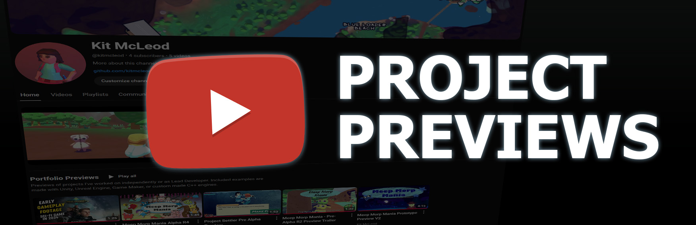
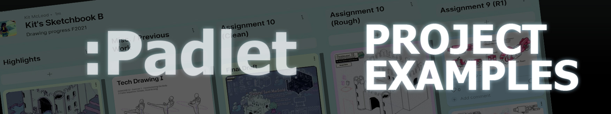

<h1>Kit McLeod Game Developer, Programmer</h1>

<h3 align="right">
  &nbsp;
  &nbsp;
  <a href="mailto:kitmcleod64@gmail.com" target="_blank">✉KitMcLeod64@Gmail.com</a>
</h3>

---

  Hi, I'm Kit McLeod, a Game Developer and Programmer experienced in Unity, Unreal Engine, C#, and C++. I have 2 years of experience working as a Lead Developer in small teams and have been creating interactive projects as a life-long hobby.

 

 
<h2>💼 Experience</h2>

- <b>Engineer II (Game Developer)</b> 
  Honour Bound Game Studios Inc. 
  May 2023 - Jul 2024
  
- <b>Electrical Designer</b> 
  Goodkey, Weedmark & Associates Limited 
  Jul 2018 - Jul 2020

 
<h2>🎓 Education</h2>

- <b>Game Development (Programming Stream)</b> 
  Algonquin College of Applied Arts and Technology

- <b>Electrical Engineering Technology</b> 
  Algonquin College of Applied Arts and Technology
